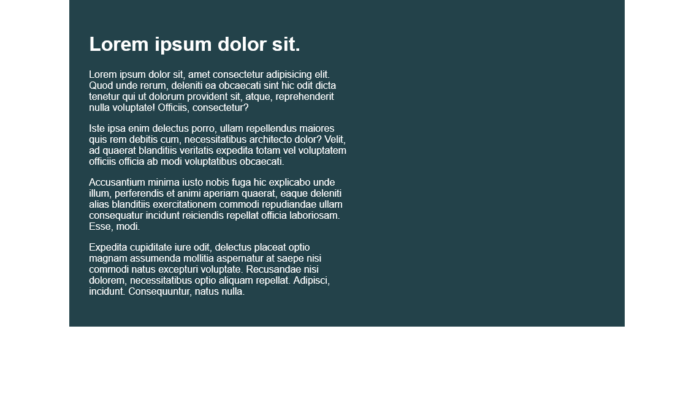
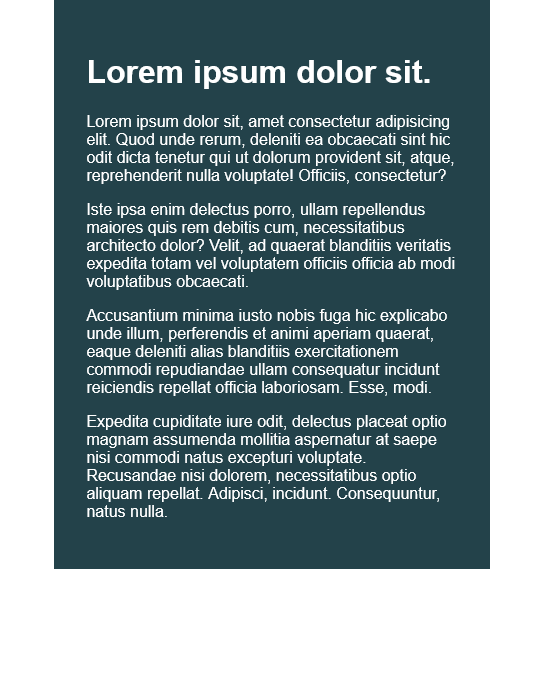

## First Challenge Solution
This is the first challenge of the Kevin Powell (Conquering responsiveness course)


### The challenge
1) Limit the total width of the .intro-content to about half of it's parent  
2) Stop the text from overflowing out the bottom at small screen widths. 
3) You may modify the HTML if needed
 
### Screenshot




### Links

- Solution URL: [Add solution URL here](https://your-solution-url.com)
- Live Site URL: [Add live site URL here](https://your-live-site-url.com)


### Built with

- Semantic HTML5 markup
- CSS custom properties

## What I learned


```css
.proud-of-this-css {
  color: papayawhip;
  
@media (max-width:900px) {
  .container{
    display:flex;
  }
  .intro-content{
    flex-direction:row;
    max-width: 100%;
  }
}
}
```

### Continued development

Learn More about Respomsive designs 


### Useful resources

  [First Section](https://courses.kevinpowell.co/view/courses/conquering-responsive-layouts/)


## Author

- Twitter - [@Amani-0ff](https://www.twitter.com/Amani-0ff)
